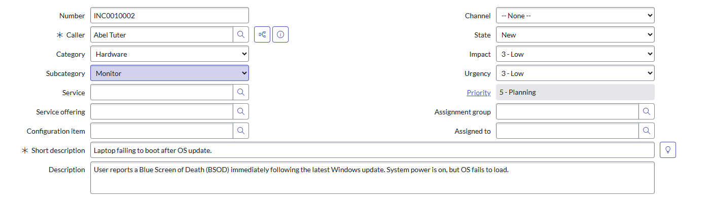
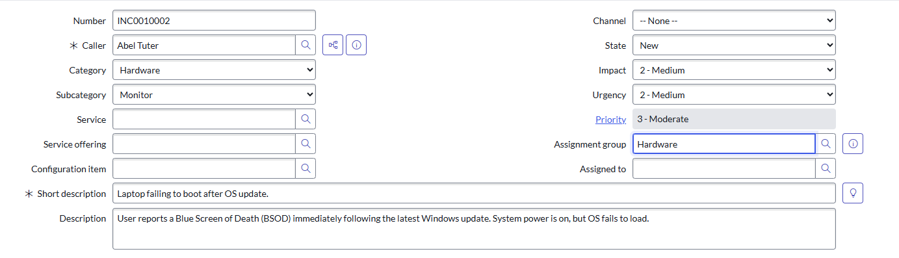
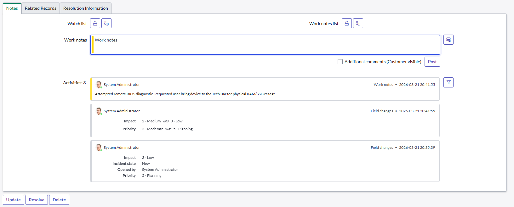
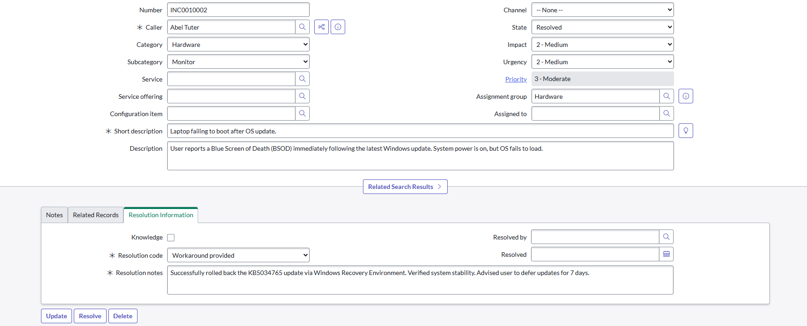
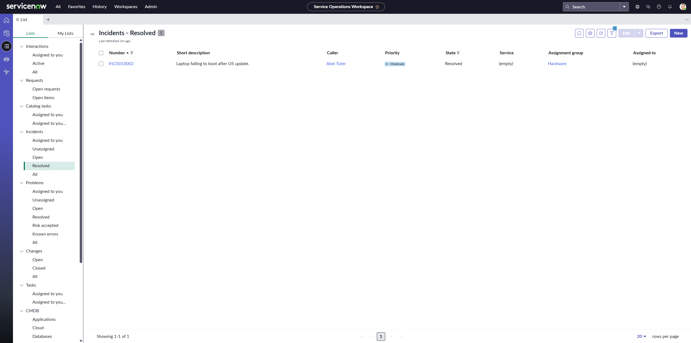

# ServiceNow-Incident-Lab
Document the end-to-end lifecycle of an ITIL incident within the ServiceNow platform.

## 1. Incident Initiation
Initiating a new Hardware incident for a system boot failure, ensuring proper categorization and impact assessment.

* **Number:** INC001002 
* **Short Description:** Laptop failing to boot after OS update.
* **Description:** User reports a Blue Screen of Death (BSOD) immediately following the latest Windows update.

---

## 2. Priority Matrix & Assignment
Utilizing the ServiceNow Priority Matrix to automatically calculate ticket importance based on business impact and urgency.

* **Impact:** 2 - Medium 
* **Urgency:** 2 - Medium 
* **Priority:** 3 - Moderate 
* **Assignment Group:** Hardware 

---

## 3. Activity Logging & Collaboration
Documenting internal technical steps and communication within the ticket activity log for audit and collaboration.

* **Work Notes:** Attempted remote BIOS diagnostic. Requested user bring device to the Tech Bar for physical RAM/SSD reseat.
* **System Audit:** Logged transition of Impact from "3 - Low" to "2 - Medium".

---

## 4. Resolution Information
Closing the incident lifecycle with a detailed resolution summary and appropriate closure code.

* **Resolution Code:** Workaround provided.
* **Resolution Notes:** Successfully rolled back the KB5034765 update via Windows Recovery Environment.
* **Stability:** Verified system stability and advised user to defer updates for 7 days.

---

## 5. Operations Workspace Monitoring
Utilizing the ServiceNow Service Operations Workspace to monitor real-time incident metrics and technician workload.

* **View:** Resolved Incidents List.
* **Status:** INC001002 marked as Resolved in the global workspace.
